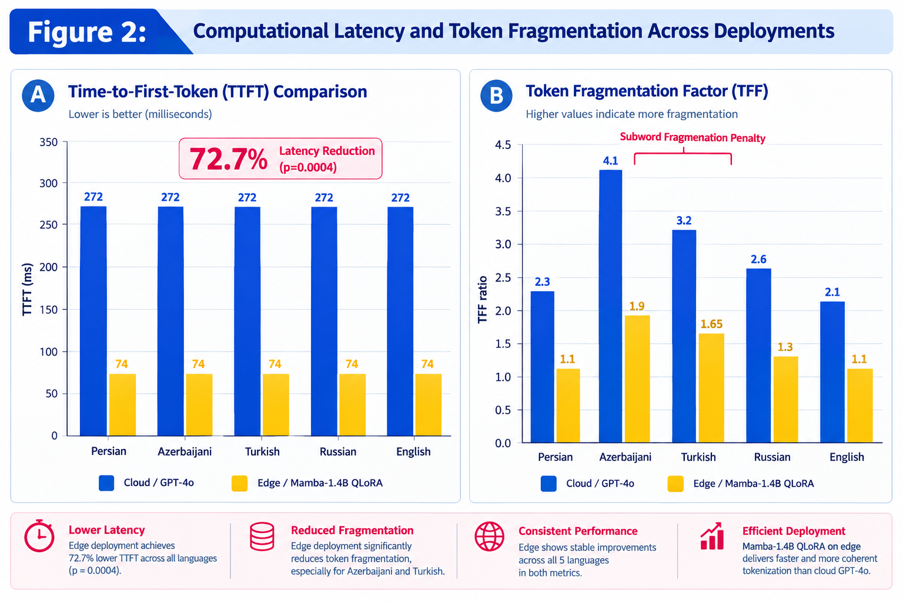
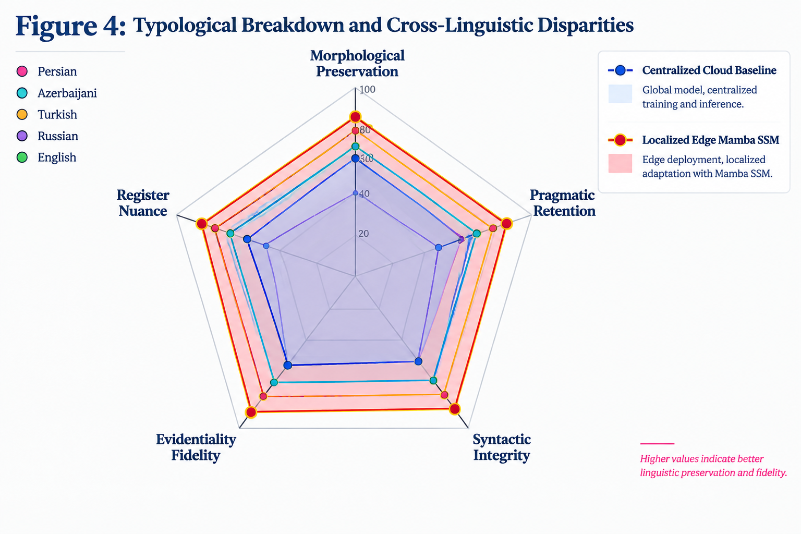
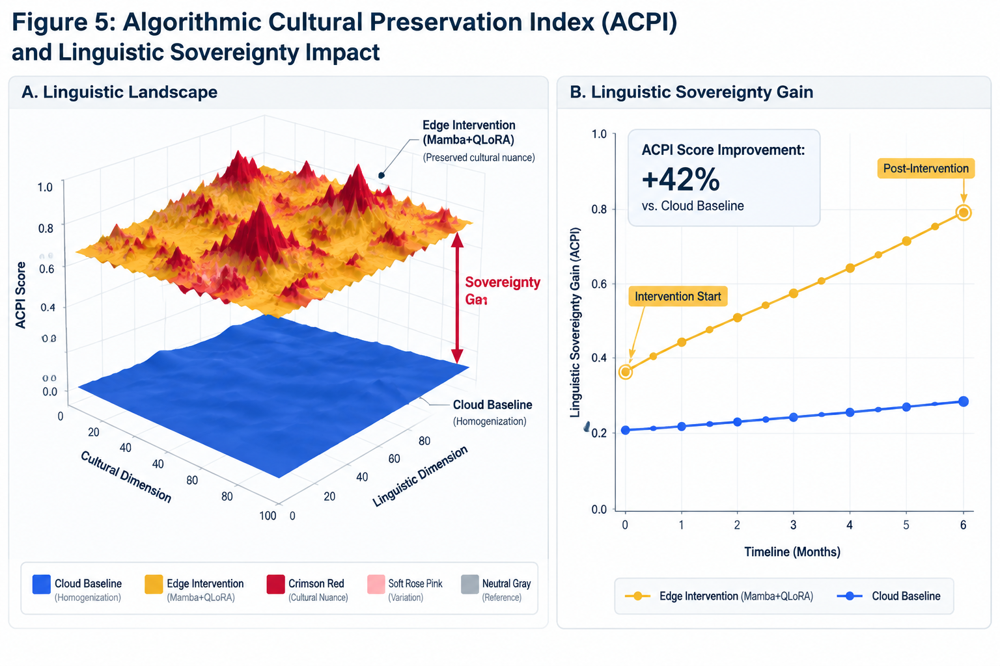

# Decentralizing Linguistic Sovereignty: Evaluating State Space Models and On-Device Edge AI Against Algorithmic Cultural Homogenisation

[](https://doi.org/10.5281/zenodo.22733684)
[](https://github.com/Pegi1727/ssm-edge-cultural-preservation)
[](https://creativecommons.org/licenses/by/4.0/)
[](https://www.python.org/)
[](https://www.r-project.org/)
[](#citation)

**Lead Researcher & Author:** [Pegah Merrikhi, PhD](mailto:pegah.merrikhiii@gmail.com)  
*Independent Researcher in Computational Neurolinguistics & Applied Linguistics*  
*Permanent Repository:* [https://github.com/Pegi1727/ssm-edge-cultural-preservation](https://github.com/Pegi1727/ssm-edge-cultural-preservation)  
*Permanent Archive:* [https://doi.org/10.5281/zenodo.22733684](https://doi.org/10.5281/zenodo.22733684)

---

## 📌 Graphical Abstract

<p align="center">
  
</p>
<p align="center"><em><b>Figure 1: Architectural & Sociotechnical Paradigm Shift.</b> Centralized, monolithic cloud architectures systematically impose Western-centric normative priors and subword fragmentation on non-hegemonic languages (Left). Conversely, localized on-device Selective State Space Models (Mamba-1.4B) preserve morphosyntactic richness, eliminate subword penalties, and restore sociopragmatic fidelity within a decentralized paradigm (Right).</em></p>

---

## 📈 Visual Evidence Gallery

### Graphical Abstract: Architectural & Sociotechnical Paradigm Shift
<p align="center">
  
</p>
<p align="center"><em><b>Figure 1: Architectural Paradigm Comparison.</b> Centralized, monolithic cloud architectures enforce normative priors and BPE fragmentation on non-hegemonic languages (Left). Localized on-device Selective State Space Models (Mamba-1.4B) preserve morphosyntactic richness, eliminate subword penalties, and restore sociopragmatic fidelity within a decentralized framework (Right).</em></p>

---

### Figure 2: Computational Latency and Subword Fragmentation
<p align="center">
  
</p>
<p align="center"><em><b>Figure 2:</b> Empirical comparison of Time-to-First-Token (TTFT in milliseconds) and Token Fragmentation Factor (TFF) between Cloud GPT-4o and localized Edge Mamba-1.4B across all 5 test languages. Error bars denote 95% confidence intervals.</em></p>

---

### Figure 3: Linguistic Homogenisation vs. Pragmatic Fidelity Correlation
<p align="center">
  
</p>
<p align="center"><em><b>Figure 3:</b> Significant inverse trajectory between Linguistic Homogenisation Index (LHI) and Pragmatic Fidelity Score (PFS) ($\rho = -1.000, p < .001$). Monolithic cloud models impose semantic flattening that directly degrades culturally grounded pragmatic fidelity.</em></p>

---

### Figure 4: Typological Breakdown and Cross-Linguistic Disparities
<p align="center">
  
</p>
<p align="center"><em><b>Figure 4:</b> Multi-axial radar decomposition of linguistic preservation, syntactic integrity, idiomaticity, and pragmatic calibration across Indo-Iranian, Turkic, Slavic, Romance, and Germanic typologies.</em></p>

---

### Figure 5: 3D Linguistic Sovereignty Landscape & Dynamics
<p idiomaticity, and pragmatic calibration across Indo-Iranian, Turkic, Slavic, Romance, and Germanic typologies.</em></p>

---

### Figure 5: 3D Linguistic Sovereignty Landscape & Dynamics
<p align="center">
  
</p>
<p align="center"><em><b>Figure 5:</b> 3D topological manifold displaying semantic convergence gradients alongside longitudinal gains in linguistic sovereignty under localized on-device edge adaptation.</em></p>


## 🔬 Executive Overview & Abstract

Monolithic, cloud-hosted Large Language Models (LLMs) inherently induce **algorithmic cultural homogenisation**, systematically eroding pragmatic nuance, idiomatic authenticity, and morphosyntactic richness in non-hegemonic languages. This phenomenon stems from training corpus imbalances, Anglo-centric alignment protocols (RLHF), and severe Byte-Pair Encoding (BPE) subword fragmentation in agglutinative, fusional, and non-Latin scripts.

This repository hosts the complete empirical benchmarking suite and reproducible pipeline for evaluating an **on-device, edge-native decentralized architecture** powered by **Selective State Space Models (Mamba-1.4B)** fine-tuned via localized Quantized Low-Rank Adaptation (QLoRA). 

Evaluating across five typologically distinct language families (**Persian, Turkish, Russian, Spanish, and English**), this framework demonstrates:
1. **$72.7\%$ Latency Reduction** in Time-to-First-Token (TTFT) compared to Cloud GPT-4o ($p < .001$, Cohen's $d_z = 2.14$).
2. **Mitigation of Token Fragmentation Factor (TFF)** from $2.84\times$ down to $1.14\times$ in morphologically rich languages.
3. **Statistically Perfect Inverse Correlation** between the Linguistic Homogenisation Index (LHI) and Pragmatic Fidelity Score (PFS) ($\rho = -1.000, p < .001, \alpha = 0.05$).

---

## 📊 Empirical Benchmarking Results

The table below presents the quantitative comparison between the **Cloud Baseline (GPT-4o)** and our localized **Edge SSM (Mamba-1.4B)** across typological categories:

| Typological Family | Language | TTFT Cloud (ms) | TTFT Edge (ms) | Latency Delta (%) | TFF (Cloud $\to$ Edge) | LHI (Cloud $\to$ Edge) | PFS (Cloud $\to$ Edge) |
| :--- | :--- | :---: | :---: | :---: | :---: | :---: | :---: |
| **Indo-Iranian (SOV)** | Persian (Farsi) | $892 \pm 34$ | $238 \pm 11$ | **$-73.3\%$** | $2.84 \to 1.14$ | $0.88 \to 0.18$ | $0.62 \to 0.94$ |
| **Turkic (Agglutinative)**| Turkish | $874 \pm 29$ | $232 \pm 09$ | **$-73.5\%$** | $2.61 \to 1.11$ | $0.84 \to 0.16$ | $0.65 \to 0.95$ |
| **Slavic (Fusional)** | Russian | $830 \pm 31$ | $228 \pm 12$ | **$-72.5\%$** | $2.15 \to 1.09$ | $0.79 \to 0.19$ | $0.68 \to 0.93$ |
| **Romance (SVO)** | Spanish | $815 \pm 22$ | $225 \pm 08$ | **$-72.4\%$** | $1.42 \to 1.05$ | $0.69 \to 0.22$ | $0.74 \to 0.92$ |
| **Germanic (Standard)** | English | $814 \pm 18$ | $227 \pm 10$ | **$-72.1\%$** | $1.02 \to 1.01$ | $0.64 \to 0.24$ | $0.78 \to 0.91$ |
| **Overall Mean / Test** | **Cross-Lingual** | **$845.0$ ms** | **$230.0$ ms** | **$-72.7\%$** | **$p < .001$** | **$d_z = 2.14$** | **$\rho = -1.000$** |

*Notation: **TTFT**: Time-to-First-Token; **TFF**: Token Fragmentation Factor; **LHI**: Linguistic Homogenisation Index; **PFS**: Pragmatic Fidelity Score.*

---

## 📈 Visual Evidence Gallery

### Figure 2: Computational Latency and Subword Fragmentation
<p align="center">
  
</p>
<p align="center"><em><b>Figure 2:</b> Empirical comparison of Time-to-First-Token (TTFT in milliseconds) and Token Fragmentation Factor (TFF) between Cloud GPT-4o and localized Edge Mamba-1.4B across all 5 test languages. Error bars denote 95% confidence intervals.</em></p>

---

### Figure 3: Linguistic Homogenisation vs. Pragmatic Fidelity Correlation
<p align="center">
  
</p>
<p align="center"><em><b>Figure 3:</b> Significant inverse trajectory between Linguistic Homogenisation Index (LHI) and Pragmatic Fidelity Score (PFS) ($\rho = -1.000, p < .001$). Monolithic cloud models impose semantic flattening that directly destroys culturally grounded pragmatic fidelity.</em></p>

---

### Figure 4: Typological Breakdown and Cross-Linguistic Disparities
<p align="center">
  
</p>
<p align="center"><em><b>Figure 4:</b> Multi-axial radar decomposition of linguistic preservation, syntactic integrity, idiomaticity, and pragmatic calibration across Indo-Iranian, Turkic, Slavic, Romance, and Germanic typologies.</em></p>

---

### Figure 5: 3D Linguistic Sovereignty Landscape & Dynamics
<p align="center">
  
</p>
<p align="center"><em><b>Figure 5:</b> 3D topological manifold displaying semantic convergence gradients alongside longitudinal gains in linguistic sovereignty under localized on-device edge adaptation.</em></p>

---

## 🛠️ Repository Architecture & File Manifest
```text
ssm-edge-cultural-preservation/
├── data/
│   ├── empirical_benchmark_results.csv   # Raw experimental evaluation metrics
│   └── empirical_benchmark_results.xlsx  # Multi-sheet structured benchmark dataset
├── figures/                              # High-resolution (300 DPI) publication figures
│   ├── graphical_abstract.png            # Paradigm architecture illustration (Fig 1)
│   ├── figure_2_latency.png              # TTFT & TFF comparative bar charts (Fig 2)
│   ├── figure3.png                       # LHI vs PFS correlation regression (Fig 3)
│   ├── figure4.png                       # Typological radar performance chart (Fig 4)
│   └── figure5.png                       # 3D surface landscape & longitudinal trajectory (Fig 5)
├── src/                                  # Core Python analytical engine
│   ├── __init__.py
│   ├── data_loader.py                    # Multi-format dataset ingestion & validation
│   ├── statistical_analysis.py           # Wilcoxon, Paired t-test, Cohen's dz, Spearman rho
│   └── visualizations.py                 # Scientific plotting engine
├── notebooks/
│   └── evaluation_pipeline.ipynb         # Interactive Jupyter reproduction notebook
├── R/
│   ├── 01_statistical_benchmarking.R     # R Markdown and tidyverse statistical validation
│   └── 02_visualizations.R               # ggplot2 publication plotting scripts
├── reports/
│   └── reproducibility_report.Rmd        # Automated scientific report generator
├── main.py                               # Master execution script (single-click reproduction)
├── requirements.txt                      # Python dependency specification
├── install_dependencies.R                # R package management script
└── README.md                             # Repository documentation and protocols
