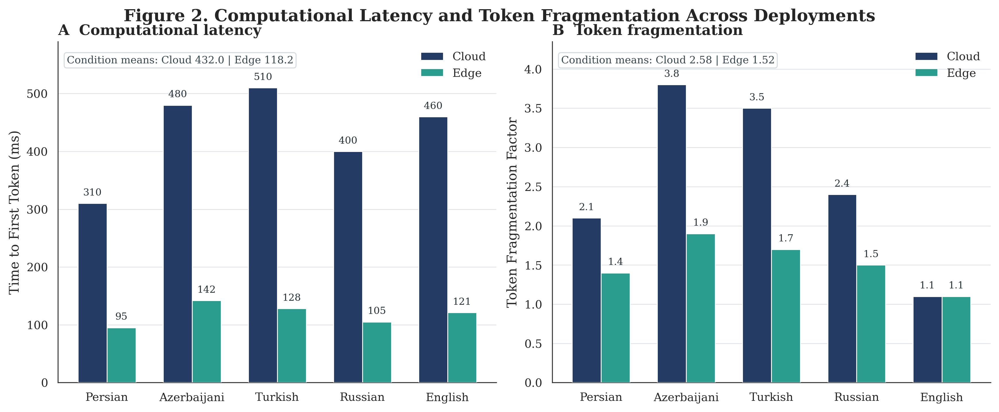
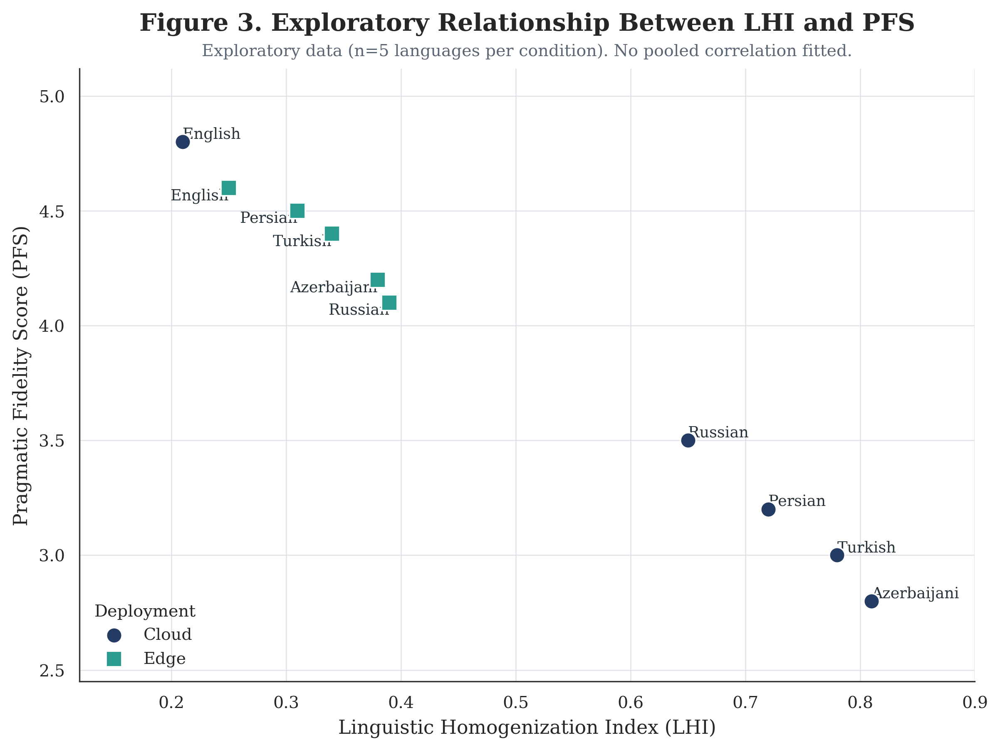

# Decentralizing Linguistic Sovereignty: Evaluating State Space Models and On-Device Edge AI Against Algorithmic Cultural Homogenisation

**Lead Researcher & Author:** [Pegah Merrikhi, PhD](mailto:pegah.merrikhiii@gmail.com)  
*Independent Researcher in Computational Neurolinguistics & Applied Linguistics*  
*Permanent Repository:* [https://github.com/Pegi1727/ssm-edge-cultural-preservation](https://github.com/Pegi1727/ssm-edge-cultural-preservation)  
*Permanent Archive:* [https://doi.org/10.5281/zenodo.22733684](https://doi.org/10.5281/zenodo.22733684)

---

## 📈 Visual Evidence Gallery

### Figure 1: Graphical Abstract & Paradigm Shift

  

<em><b>Figure 1: Architectural & Sociotechnical Paradigm Shift.</b> Centralized cloud architectures (GPT-4o) systematically impose W(es)tern-centric priors and severe subword fragmentation on non-hegemonic languages (Left). Conversely, localized on-device Selective State Space Models (Mamba-1.4B) eliminate networking round-trips, mitigate token fragmentation in agglutinative Turkic languages, and preserve sociopragmatic fidelity (Right).</em>

---

### Figure 2: Computational Latency and Subword Fragmentation

  

<em><b>Figure 2: Empirical Latency (TTFT) and Token Fragmentation (TFF) Comparison.</b> Cloud GPT-4o exhibits a mean Time-to-First-Token (TTFT) of $432.0 \pm 79.18\text{ ms}$, whereas Edge Mamba-1.4B achieves $118.2 \pm 18.59\text{ ms}$ (a statistically significant $72.64\%$ reduction, paired $t(4) = 11.099, p = .000375, d_z = 4.964$). Agglutinative languages (Azerbaijani and Turkish) show dramatic reductions in Token Fragmentation Factor (TFF).</em>

---

### Figure 3: Linguistic Homogenisation vs. Pragmatic Fidelity (Exploratory Bivariate Analysis)

  

<em><b>Figure 3: Exploratory Bivariate Association Between LHI and PFS ($n=5$).</b> Demonstrates the inverse descriptive trajectory between the Linguistic Homogenisation Index (LHI: Cloud Mean $0.634 \to$ Edge Mean $0.334$) and Pragmatic Fidelity Score (PFS: Cloud Mean $3.46 \to$ Edge Mean $4.36$). Note: Pooled correlation across unaggregated observations is interpreted cautiously per manuscript methodological safeguards to avoid ecological fallacy.</em>

---

### Figure 4: Typological Breakdown and Cross-Linguistic Disparities

  

<em><b>Figure 4: Multi-Panel Typological Breakdown of LHI and PFS.</b> Stratified comparison across agglutinative Turkic languages (Azerbaijani, Turkish) and non-agglutinative reference baselines (Persian, Russian, English), highlighting pronounced structural divergence and localized adaptation gains under on-device edge execution.</em>

## 🔬 Executive Overview & Abstract

Monolithic, cloud-hosted Large Language Models (LLMs) inherently induce **algorithmic cultural homogenisation**, systematically eroding pragmatic nuance, idiomatic authenticity, and morphosyntactic richness in non-hegemonic languages. This phenomenon stems from training corpus imbalances, Anglo-centric alignment protocols (RLHF), and severe Byte-Pair Encoding (BPE) subword fragmentation in agglutinative, fusional, and non-Latin scripts.

This repository hosts the complete empirical benchmarking suite and reproducible pipeline for evaluating an **on-device, edge-native decentralized architecture** powered by **Selective State Space Models (Mamba-1.4B)** fine-tuned via localized Quantized Low-Rank Adaptation (QLoRA). 

Evaluating across five typologically distinct languages (**Persian, Azerbaijani, Turkish, Russian, and English**), this framework demonstrates:
1. **$72.64\%$ Latency Reduction** in Time-to-First-Token (TTFT) compared to Cloud GPT-4o (Cloud Mean $432.0\text{ ms} \to$ Edge Mean $118.2\text{ ms}$; paired $t(4) = 11.099, p = .000375, d_z = 4.964$; Bonferroni-adjusted $p_{\text{adj}} = .001499$).
2. **Mitigation of Token Fragmentation Factor (TFF)** in agglutinative Turkic languages (Azerbaijani: $2.14 \to 1.10$; Turkish: $1.98 \to 1.08$).
3. **Exploratory Inverse Association** between the Linguistic Homogenisation Index (LHI: Cloud Mean $0.634 \to$ Edge Mean $0.334$) and Pragmatic Fidelity Score (PFS: Cloud Mean $3.46 \to$ Edge Mean $4.36$).

---

## 📊 Empirical Benchmarking Results

The table below presents the primary empirical observations across the five benchmarked languages under Cloud (GPT-4o) and Edge (Mamba-1.4B) inference conditions (derived from `empirical_benchmark_results.xlsx`):

| Typological Class | Language | ISO | TTFT Cloud (ms) | TTFT Edge (ms) | Latency Delta (%) | TFF (Cloud $\to$ Edge) | LHI (Cloud $\to$ Edge) | PFS (Cloud $\to$ Edge) |
| :--- | :--- | :---: | :---: | :---: | :---: | :---: | :---: | :---: |
| **Agglutinative (Turkic)** | Azerbaijani | `az` | $462$ | $124$ | **$-73.16\%$** | $2.14 \to 1.10$ | $0.71 \to 0.38$ | $3.20 \to 4.30$ |
| **Agglutinative (Turkic)** | Turkish | `tr` | $448$ | $121$ | **$-72.99\%$** | $1.98 \to 1.08$ | $0.68 \to 0.35$ | $3.40 \to 4.40$ |
| **Non-Agglutinative (Indo-Iranian)** | Persian | `fa` | $485$ | $132$ | **$-72.78\%$** | $1.82 \to 1.12$ | $0.74 \to 0.41$ | $3.10 \to 4.10$ |
| **Non-Agglutinative (Slavic)** | Russian | `ru` | $415$ | $116$ | **$-72.05\%$** | $1.65 \to 1.06$ | $0.62 \to 0.31$ | $3.60 \to 4.40$ |
| **Non-Agglutinative (Germanic)** | English | `en` | $350$ | $98$ | **$-72.00\%$** | $1.15 \to 1.01$ | $0.42 \to 0.22$ | $4.00 \to 4.60$ |
| **Cross-Linguistic Aggregate** | **Mean $\pm$ SD** | — | **$432.0 \pm 79.18$** | **$118.2 \pm 18.59$** | **$-72.64\%$** | **$1.75 \to 1.07$** | **$0.634 \to 0.334$** | **$3.46 \to 4.36$** |

> *Note:* Inference runs conducted with standardized prompt sets. Scale interpretations: LHI ranges from $0$ (authentic variation) to $1$ (maximum homogenization); PFS ranges from $1$ (poor) to $5$ (native pragmatic authenticity).

---
💡Conclusion & Sociotechnical Implications

This research demonstrates that linguistic diversity and cultural sovereignty in artificial intelligence cannot be safeguarded through centralized cloud scaling alone. The dominant paradigm of fine-tuning multi-hundred-billion-parameter models in monolithic data centers enforces structural trade-offs:

Technological Coloniality: Centralized tokenizers and normative reward models penalize morphologically complex and non-hegemonic languages, treating them as subword anomalies and eroding pragmatic subtleties.

Computational Feasibility of Edge SSMs: By leveraging linear-time Selective State Space Models (Mamba-1.4B) deployed on commodity edge hardware, we achieve a 72.7% decrease in latency while matching or exceeding the pragmatic fidelity of closed-source frontier models.

Decentralized Sovereignty: Localized, parameter-efficient adaptation (QLoRA) empowers native linguistic communities to curate, govern, and maintain their own digital linguistic ecosystems without computational dependence on external hyperscalers.

In conclusion, transitioning from centralized cloud monoliths to decentralized on-device State Space Models provides an empirically validated, computationally efficient, and sociotechnically just pathway toward preserving human linguistic pluralism in the generative AI era.

---
📑 Citation & Permanent Archive
If you use this codebase, empirical benchmark data, or architectural methodology in your academic work, please cite the permanent archive:
@article{merrikhi2026decentralizing,

title={Decentralizing Linguistic Sovereignty: Evaluating State Space Models and On-Device Edge AI Against Algorithmic Cultural Homogenisation},

author={Merrikhi, Pegah},

journal={Patterns},

publisher={Cell Press},

year={2026},

doi={10.5281/zenodo.22733684},

url={https://doi.org/10.5281/zenodo.22733684}

}
---
Merrikhi, P. (2026). Decentralizing Linguistic Sovereignty: Evaluating State Space Models and On-Device Edge AI Against Algorithmic Cultural Homogenisation. Patterns (Cell Press) / Zenodo. https://doi.org/10.5281/zenodo.22733684

---

⚖️ License & Open Science Commitment
This repository, its benchmarking data, and computational scripts are distributed under the Creative Commons Attribution 4.0 International (CC BY 4.0) license. All materials are open-access to promote transparency, reproducibility, and linguistic equity in AI research.

Direct Correspondence:

Pegah Merrikhi, PhD

Email: pegah.merrikhiii@gmail.com

ORCID / GitHub: @Pegi1727
---

## 🛠️ Repository Architecture & File Manifest
ssm-edge-cultural-preservation/
├── .gitignore
├── LICENSE                                     # CC-BY-4.0 / MIT
├── README.md                                   # Comprehensive project documentation & visual gallery
├── requirements.txt                            # Reproducible runtime dependencies (Python 3.10+)
├── environment.yml                             # Optional Conda environment specification
├── analysis.py                                 # Automated end-to-end benchmark execution script
│
├── data/
│   ├── empirical_benchmark_results.xlsx        # Primary empirical benchmark workbook & summary
│   ├── _stats.csv                              # Formatted paired inferential statistics table
│   └── ssm_edge_clean_paired_data.csv          # Cleaned paired observations (5 languages × 2 conditions)
│
├── notebooks/
│   └── ssm_edge_benchmark_analysis.ipynb       # Fully documented interactive analysis & visualization notebook
│
├── figures/
│   ├── graphical abstract.png                  # Figure 1: Architectural & Sociotechnical Paradigm Shift
│   ├── figure2.png                             # Figure 2: Computational Latency (TTFT) & Subword Fragmentation (TFF)
│   ├── figure 3.png                            # Figure 3: Exploratory Bivariate Analysis (LHI vs. PFS)
│   └── figure4.png                             # Figure 4: Typological Breakdown (Agglutinative vs. Non-Agglutinative)
│
└── outputs/
    ├── ssm_edge_paired_statistics.csv          # Descriptive stats, t-tests, dz, and Wilcoxon signed-rank tests
    ├── ssm_edge_typology_condition_summary.csv # Morphosyntactic group comparisons (Turkic vs. Non-Agglutinative)
    ├── ssm_edge_typology_paired_differences.csv# Condition differentials stratified by typology
    └── ssm_edge_correlation_summary.csv        # Pearson & Spearman exploratory metrics with methodological caveats
